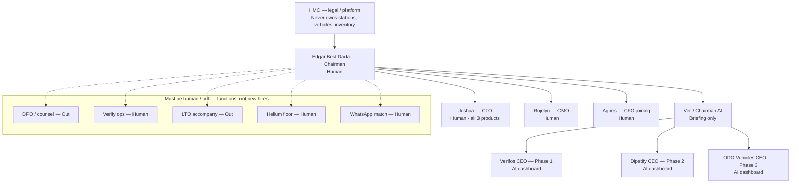
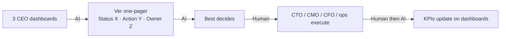
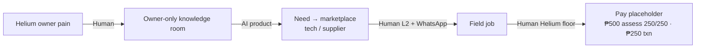
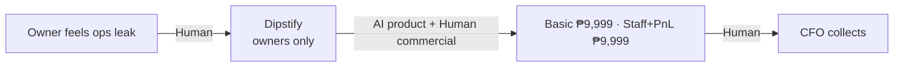

# HMC / Founder OS — Org chart and workflows

Locked: 20 Aug 2026  
Owner: Edgar “Best” Dada  
Status: Active — People/Admin org for Founder OS. Dashboards, not companies.

HMC (Helium Marketing Corporation) is the **legal / platform**. It never owns stations, vehicles, or inventory.

Three AI CEOs are **dashboards in Founder OS**, not companies. Do not merge Verifos and Dipstify. Phase 1 live product = **Verifos** (verifos.co). Do not add an RV CEO. RV franchise stays a later program in RV docs.

---

## Org (who reports)

```
HMC — legal / platform                         Legal
  └── Edgar “Best” Dada — Chairman             Human
        decides · Helium cluster · station relationships
        ├── Ver / Chairman AI                  AI
        │     briefing loop only
        │     ├── Verifos CEO                  AI · Phase 1
        │     ├── Dipstify CEO                 AI · Phase 2
        │     └── ODO-Vehicles CEO             AI · Phase 3
        ├── Joshua — CTO                       Human · all three products
        ├── Rojelyn — CMO                      Human · Notion / Telegram, not Desktop
        └── Agnes — CFO (joining)              Human · collect, fees, books
```

**Must be human / out** (functions Best owns — not new hire boxes):

| Function | Kind | Where |
|---|---|---|
| DPO / counsel | Out | NPC, privacy, HMC contracts |
| Verify ops | Human | In-house (Best + admin) until volume; then VA. IDs, L2 techs/suppliers, ODO listing review, HPG stamp |
| LTO accompany | Out | Per job (providers) |
| Helium station floor | Human | In-house Helium staff |
| WhatsApp match | Human | Best / Helium until the app does it |

**Do not hire yet:** community manager · Verifos sales army · Dipstify CS · RV franchise manager.

Ver does not hire or spend. Ver does not replace companies. Voice: *Status is X. Action needed: Y. Owner: Z.*



---

## Workflows (who stamps each arrow)

### A. Chairman loop (weekly)

Dashboards (3 CEOs) → Ver one-pager → Best decides → CTO / CMO / CFO / ops execute → KPIs update.



| Arrow | Stamp |
|---|---|
| 3 CEO dashboards → Ver one-pager | AI |
| Ver one-pager → Best decides | AI (brief only; Best is Human) |
| Best decides → execute | Human (Best) |
| Execute → KPIs update | Human does the work · AI dashboards refresh |

---

### B. Verifos — Phase 1

Helium first. Marketplace for owners, technicians, suppliers. Public URL **verifos.co**. Owner-only knowledge room. **Not scored on Dipstify conversion.** Graduation, not a gate (`docs/VERIFOS_STANDARD.md`).



| Arrow | Stamp |
|---|---|
| Helium owner pain → knowledge room | Human (owner) |
| Knowledge room → marketplace | AI product |
| Marketplace → field job | Human: L2 verify ops · WhatsApp match until the app |
| Field job → pay placeholder | Human: Helium station floor |

Pay is a placeholder (not live checkout): ₱500 assessment split 250/250; ₱250 transaction fee. No cut of job value.

---

### C. Dipstify — Phase 2

Sibling to Verifos. Owners only (later same-login). Commercial: **Basic ₱9,999** · **Staff + PnL ₱9,999**. **Not Verifos CEO’s conversion KPI.** Quiz HOLD.



| Arrow | Stamp |
|---|---|
| Ops leak → Dipstify | Human (owner) |
| Dipstify → Helium commercial sheet | AI product · Human commercial terms |
| Commercial → collect | Human (Agnes / CFO) |

---

### D. ODO-Vehicles — Phase 3

Vehicle list → HPG → unlock → LTO checklist. Property lane still exists; **this CEO is Vehicles only.** Buyer pays seller. No % of vehicle. RV franchise = later program, not this flow, not a 4th CEO.


| Arrow | Stamp |
|---|---|
| List → admin publish | Human (seller) then Human (admin / verify ops) |
| Admin publish → poke | Human verify ops |
| Poke → HPG ₱500 | AI product · **Human stamp** on HPG |
| HPG → unlock ₱500 | Human pay + product unlock |
| Unlock → LTO checklist | AI product |
| LTO checklist → LTO accompany | Out (provider, per job) |
| Accompany → buyer pays seller | Human (buyer → seller). HMC takes no % of vehicle |

---

### E. Human vs AI on every arrow (index)

| Flow | From → To | Who stamps |
|---|---|---|
| A Chairman | 3 CEO dashboards → Ver one-pager | AI |
| A Chairman | Ver one-pager → Best decides | AI brief · Human decides |
| A Chairman | Best decides → CTO/CMO/CFO/ops | Human |
| A Chairman | Execute → KPIs update | Human work · AI refresh |
| B SR | Owner pain → knowledge room | Human |
| B SR | Knowledge → marketplace | AI |
| B SR | Marketplace → field job | Human (L2 + WhatsApp) |
| B SR | Field job → pay placeholder | Human (Helium floor) |
| C Dipstify | Ops leak → Dipstify | Human |
| C Dipstify | Dipstify → ₱9,999 Basic · ₱9,999 Staff+PnL | AI product · Human commercial |
| C Dipstify | EOM → CFO collects | Human |
| D ODO-Vehicles | List → admin publish | Human |
| D ODO-Vehicles | Publish → poke | Human (verify ops) |
| D ODO-Vehicles | Poke → HPG ₱500 | AI · Human HPG stamp |
| D ODO-Vehicles | HPG → unlock ₱500 | Human |
| D ODO-Vehicles | Unlock → LTO checklist | AI |
| D ODO-Vehicles | Checklist → LTO accompany | Out |
| D ODO-Vehicles | Accompany → buyer pays seller | Human |

---

## Hard stops

- Do not merge SR and Dipstify.
- Do not add an RV CEO. Franchise program stays in RV docs.
- Do not hire community manager, SR sales army, Dipstify CS, or RV franchise manager.
- HMC never owns stations, vehicles, or inventory.
- Ver does not hire, spend, or replace companies.
